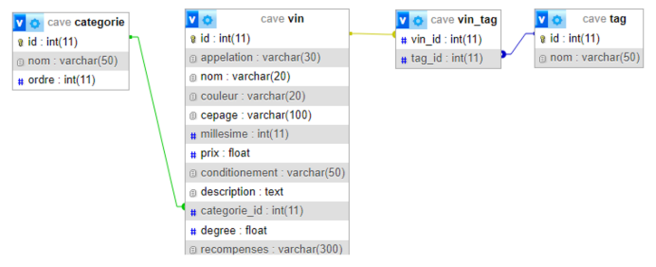
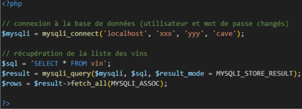
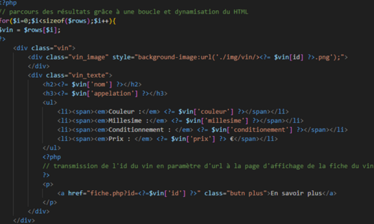
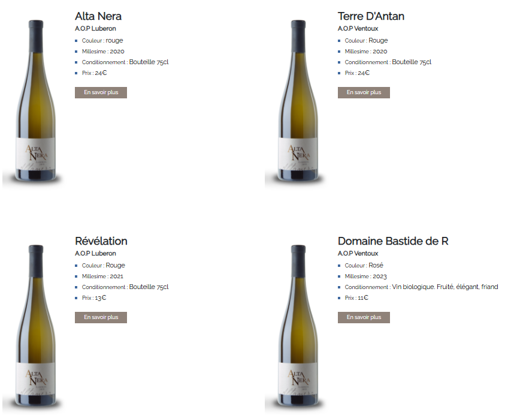
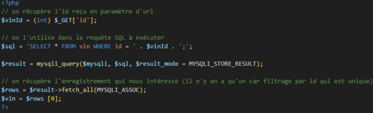
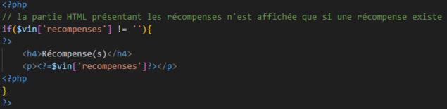
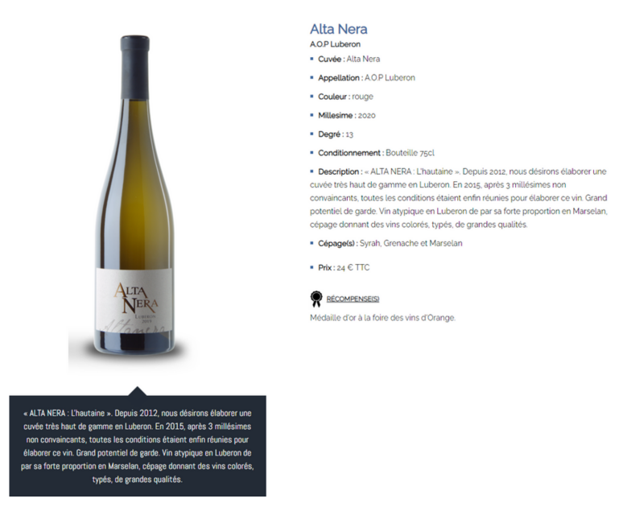

<h1 align="center">🍷 Cave Viticole</h1>

## 📝 Présentation du projet  
Le client possède déjà un site vitrine et souhaite une **nouvelle section** pour présenter ses vins.

---

## ✅ Travail réalisé

- Création de **nouvelles tables** dans la base de données.
- Ajout de **nouveaux scripts PHP** :
  - 📄 Liste des vins
  - 📄 Fiche vin

---

# 🗃️ Les tables

---

# ⚙️ Dynamisation des pages

1. Connexion à la **base de données**  
2. Requête pour **récupérer les informations nécessaires** (liste des vins)  
3. Utilisation de **boucles** et de **conditions** pour générer dynamiquement le HTML

---

# 📃 Page Liste

---

# 📄 Page Fiche

---
---

# 🧩 Technologies utilisées

---

## [Voir en ligne](https://www.cave-bonnieux.com/boutique/index.php/fr/catalogue/liste/)
